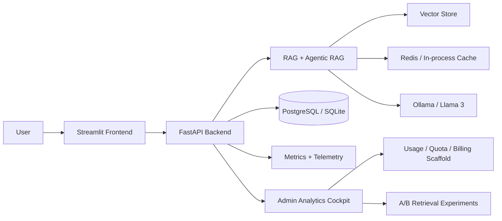
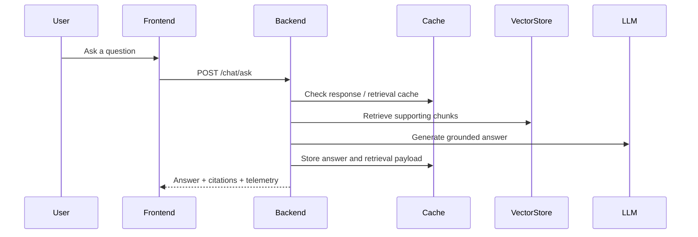

# DocuMind AI

DocuMind AI is an enterprise RAG workspace for document chat, retrieval diagnostics, admin analytics, and production deployment.

## What It Ships

- Premium Streamlit front end with a control-plane cockpit
- FastAPI backend with retrieval caching, token usage tracking, telemetry, and admin summaries
- Feature-flagged production knobs for agentic RAG, hybrid retrieval, metrics, and Redis-backed caching
- Billing and quota scaffolding driven by persisted usage data
- A/B retrieval experiment scaffolding and benchmark history
- Deployment, demo, and load-testing documentation

## Architecture





## Quickstart

Backend:

```powershell
uvicorn backend.api:app --reload
```

Frontend:

```powershell
streamlit run frontend/app.py
```

Docker stack:

```powershell
docker compose up --build
```

## Control Plane

- Admin metrics and debug state: `GET /admin/metrics`, `GET /admin/debug/state`
- Retrieval diagnostics: `GET /admin/retrieval-debug`, `GET /admin/retrieval-trace`
- Evaluation and leaderboards: `GET /admin/evaluation/datasets`, `GET /admin/evaluation/history`, `GET /admin/evaluation/leaderboard`
- Usage accounting is derived from persisted token usage records
- Cache posture is exposed through Redis availability and cache TTL settings

## Production Docs

- [Architecture](docs/architecture.md)
- [Deployment](docs/deployment.md)
- [Demo Runbook](docs/demo-runbook.md)
- [Load Testing](docs/load-testing.md)
- [Portfolio Showcase](docs/portfolio-showcase.md)

## Repository Layout

- `backend/`
- `frontend/`
- `data/`
- `vector_store/`
- `docs/`
- `scripts/`
- `tests/`

## Environment

Copy your environment file and configure the production knobs that matter most:

- `DOCUMIND_API_BASE_URL`
- `DOCUMIND_OLLAMA_BASE_URL`
- `DOCUMIND_DATABASE_URL`
- `DOCUMIND_REDIS_URL`
- `DOCUMIND_ADMIN_API_KEY`
- `DOCUMIND_ENABLE_AGENTIC_RAG`
- `DOCUMIND_ENABLE_HYBRID_RETRIEVAL`
- `DOCUMIND_ENABLE_REDIS_CACHE`
- `DOCUMIND_ENABLE_ANALYTICS_PERSISTENCE`
- `DOCUMIND_ENABLE_METRICS`

## Demo Assets

- `scripts/enterprise_demo.py` runs a live smoke-test walkthrough
- `scripts/load_test.py` benchmarks the chat endpoint under concurrency
- `frontend/app.py` now includes the admin cockpit for investor and stakeholder demos
