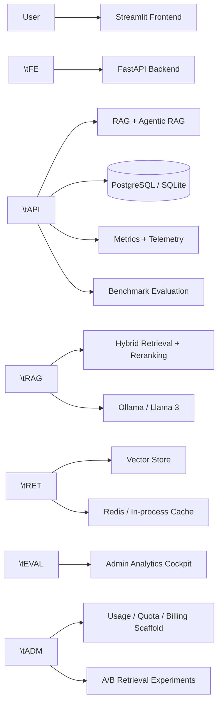

# DocuMind AI

DocuMind AI is an enterprise RAG workspace for document chat, retrieval diagnostics, evaluation, admin analytics, and production deployment.

## Why this project is different

DocuMind is designed as an **evaluated RAG system**, not only a PDF chatbot. Retrieval changes can be measured with ranking metrics and regression tests, while the existing platform exposes retrieval diagnostics, groundedness, latency, usage, and operational telemetry.

## What It Ships

- Premium Streamlit front end with a control-plane cockpit
- FastAPI backend with retrieval caching, token usage tracking, telemetry, and admin summaries
- Feature-flagged production knobs for agentic RAG, hybrid retrieval, metrics, and Redis-backed caching
- Hybrid retrieval and reranking infrastructure
- Benchmark evaluation with Precision@K, Recall@K, MAP, MRR, nDCG, groundedness, hallucination risk, and latency
- Regression-focused unit tests for ranking metrics and benchmark edge cases
- Versioned benchmark fixture and evaluation methodology
- Billing and quota scaffolding driven by persisted usage data
- A/B retrieval experiment scaffolding and benchmark history
- Deployment, demo, and load-testing documentation

## Architecture


```mermaid
flowchart LR
\tU[User] --> FE[Streamlit Frontend]
\tFE --> API[FastAPI Backend]
\tAPI --> RAG[RAG + Agentic RAG]
\tRAG --> RET[Hybrid Retrieval + Reranking]
\tRET --> VS[Vector Store]
\tRET --> CACHE[Redis / In-process Cache]
\tRAG --> OLLAMA[Ollama / Llama 3]
\tAPI --> DB[(PostgreSQL / SQLite)]
\tAPI --> MET[Metrics + Telemetry]
\tAPI --> EVAL[Benchmark Evaluation]
\tEVAL --> ADM[Admin Analytics Cockpit]
\tADM --> USG[Usage / Quota / Billing Scaffold]
\tADM --> EXP[A/B Retrieval Experiments]
```

```mermaid
sequenceDiagram
\tparticipant User
\tparticipant Frontend
\tparticipant Backend
\tparticipant Cache
\tparticipant Retriever
\tparticipant Reranker
\tparticipant LLM
\n\tUser->>Frontend: Ask a question
\tFrontend->>Backend: POST /chat/ask
\tBackend->>Cache: Check response / retrieval cache
\tBackend->>Retriever: Dense + lexical retrieval
\tRetriever->>Reranker: Candidate passages
\tReranker-->>Backend: Ranked evidence
\tBackend->>LLM: Generate grounded answer
\tBackend->>Cache: Store answer and retrieval payload
\tBackend-->>Frontend: Answer + citations + telemetry
```

## Evaluation

The benchmark layer reports:

- **Precision@K** — relevance density in the retrieved top-K
- **Recall@K** — relevant evidence recovered in the top-K
- **MAP** — ranking-sensitive average precision that penalizes missed relevant targets
- **MRR** — how early the first relevant result appears
- **nDCG@K** — ranking quality relative to an ideal ordering
- **Groundedness / hallucination risk** — answer-level quality signals
- **Retrieval / reranking / generation latency** — pipeline performance

See [`docs/evaluation.md`](docs/evaluation.md) for the metric contract and benchmark workflow.

The schema-valid example fixture is at `backend/evaluation/example_rag_benchmark.json`. It is a development fixture, **not a published performance claim**. Benchmark percentages should only be added to the README after measuring a fixed dataset and configuration.

## Quickstart

Backend:

```powershell
uvicorn backend.api:app --reload
```

Frontend:

```powershell
streamlit run frontend/app.py
```

Docker stack:

```powershell
docker compose up --build
```

Tests:

```powershell
pytest -q
```

## Control Plane

- Admin metrics and debug state: `GET /admin/metrics`, `GET /admin/debug/state`
- Retrieval diagnostics: `GET /admin/retrieval-debug`, `GET /admin/retrieval-trace`
- Evaluation and leaderboards: `GET /admin/evaluation/datasets`, `GET /admin/evaluation/history`, `GET /admin/evaluation/leaderboard`
- Usage accounting is derived from persisted token usage records
- Cache posture is exposed through Redis availability and cache TTL settings

## Production Docs

- [Architecture](docs/architecture.md)
- [Evaluation methodology](docs/evaluation.md)
- [Deployment](docs/deployment.md)
- [Demo Runbook](docs/demo-runbook.md)
- [Load Testing](docs/load-testing.md)
- [Portfolio Showcase](docs/portfolio-showcase.md)

## Repository Layout

- `backend/`
- `frontend/`
- `data/`
- `vector_store/`
- `docs/`
- `scripts/`

## Environment

Copy your environment file and configure the production knobs that matter most:

- `DOCUMIND_API_BASE_URL`
- `DOCUMIND_OLLAMA_BASE_URL`
- `DOCUMIND_DATABASE_URL`
- `DOCUMIND_REDIS_URL`
- `DOCUMIND_ADMIN_API_KEY`
- `DOCUMIND_ENABLE_AGENTIC_RAG`
- `DOCUMIND_ENABLE_HYBRID_RETRIEVAL`
- `DOCUMIND_ENABLE_REDIS_CACHE`
- `DOCUMIND_ENABLE_ANALYTICS_PERSISTENCE`
- `DOCUMIND_ENABLE_METRICS`

## Demo Assets

- `scripts/enterprise_demo.py` runs a live smoke-test walkthrough
- `scripts/load_test.py` benchmarks the chat endpoint under concurrency
- `frontend/app.py` is the Streamlit frontend entrypoint linked to the backend API
