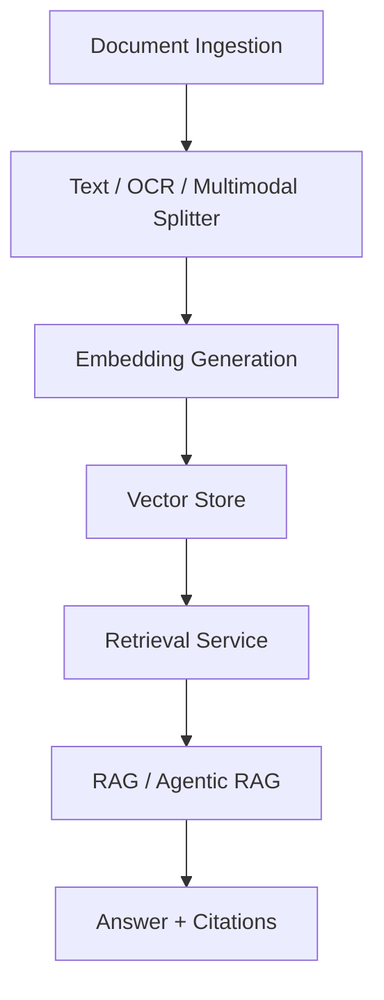
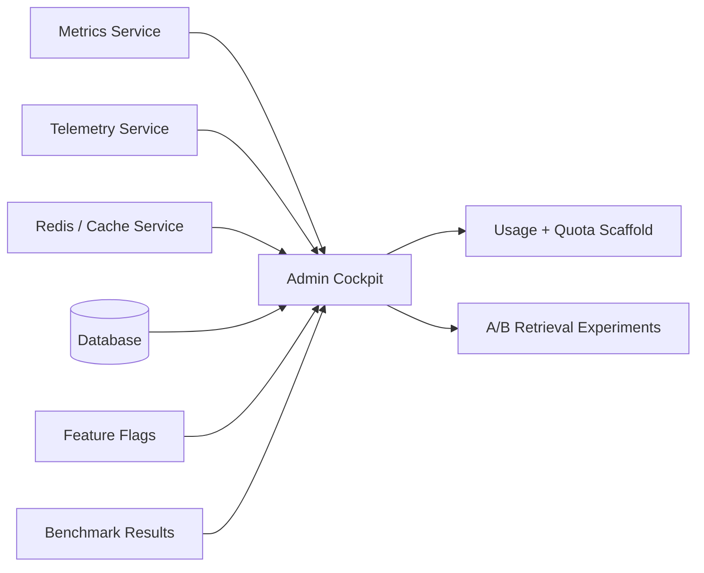

# Architecture

DocuMind AI is organized around a clear separation between the user experience, the retrieval engine, and the production control plane.

## Core Flow

## Control Plane

## Production Signals

- Request, token, and latency counters are recorded on the backend
- Retrieval traces and benchmark history are persisted for auditability
- Cache-aware retrieval and streaming paths reduce repeated work
- Feature flags allow agentic RAG, hybrid retrieval, metrics, and Redis cache rollout control

## Investor-Ready Narrative

1. Document upload and ingestion are persistent.
2. Retrieval is explainable with source citations and traceability.
3. Operational metrics are visible in the admin cockpit.
4. The platform is ready for quota, billing, and experiment rollouts.